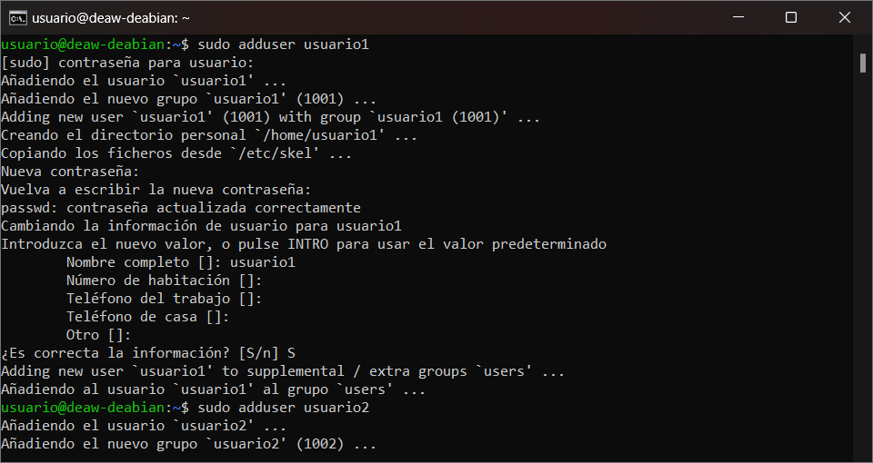

# PRÁCTICA DE AMPLIACIÓN UD2

# Configuración de un Servidor Nginx con Hosts Virtuales y Directorios de Usuario

El objetivo de esta práctica es configurar un servidor Nginx que utilice hosts virtuales para alojar múltiples sitios web en un solo servidor, cada uno apuntando al directorio `public_html` de distintos usuarios del sistema operativo Debian.

## Instalación de Nginx

1. **Instalamos Nginx en el sistema**:
    
    En mi caso estoy haciendo uso de una máquina virtual en la que ya tenia instalado el servidor nginx.


2. **Usamos SSH para interactuar con el servidor**:
    ```sh
    ssh usuario@servidor_ip
    ```
    

## Creación de Usuarios del Sistema

1. **Creamos al menos dos usuarios nuevos en el sistema**:
    ```sh
    sudo adduser usuario1
    sudo adduser usuario2
    ```
    
2. **Asignamos contraseñas seguras a cada usuario** durante el proceso de creación.

## Estructura de Carpetas y Archivos

1. **Directorios personales**:
    ```sh
    sudo -u usuario1 mkdir /home/usuario1/public_html
    sudo -u usuario2 mkdir /home/usuario2/public_html
    ```
    
2. **Permisos**:
    ```sh
    sudo chmod 755 /home/usuario1/public_html
    sudo chmod 755 /home/usuario2/public_html
    ```
    
3. **Contenido web**:
    - Cada usuario debe crear una página web sencilla dentro de su carpeta `public_html`. Ejemplo para `usuario1`:
      ```html
      <!DOCTYPE html>
      <html lang="es">
      <head>
          <meta charset="UTF-8">
          <title>Usuario 1</title>
      </head>
      <body>
          <h1>Página de Usuario 1</h1>
      </body>
      </html>
      ```
    


## Creación de Hosts Virtuales

1. **Creamos los archivos de configuración para cada web**. Ejemplo para `usuario1`:
    ```sh
    sudo nano /etc/nginx/sites-available/usuario1
    ```
    Contenido del archivo:

    
2. **Asignamos los dominios ficticios a cada host virtual**.
3. **Configuramos cada host virtual** siguiendo el ejemplo anterior.
4. **Habilitamos los enlaces simbólicos**:
    ```sh
    sudo ln -s /etc/nginx/sites-available/usuario1 /etc/nginx/sites-enabled/
    sudo ln -s /etc/nginx/sites-available/usuario2 /etc/nginx/sites-enabled/
    ```

## Configuración del Archivo Host

1. **Configuramos el archivo host en el SO huésped** para poder acceder a las distintas webs:
    ```sh
    sudo nano /etc/hosts
    ```
    Añadimos las siguientes líneas:

    

## Implementar HTTPS

1. **Generamos un certificado SSL autofirmado** para propósitos de prueba:
    ```sh
    sudo openssl req -x509 -nodes -days 365 -newkey rsa:2048 -keyout /etc/nginx/ssl/nginx-selfsigned.key -out /etc/nginx/ssl/nginx-selfsigned.crt
    ```

2. **Configuramos Nginx para usar HTTPS**. Ejemplo para `usuario1`:

    
3. **Reiniciamos Nginx para aplicar los cambios**:
    ```sh
    sudo systemctl restart nginx
    ```

4. **Abrimos la url en el navegador**

Para Usuario 1:


Para Usuario 2:


